```{r setup, include=FALSE}
knitr::opts_chunk$set(echo = TRUE)

```


### Step 1... Provisioning the Azure SQL database and Azure Blob Storage container

This project started with provisioning an Azure SQL database on a brand new server, dedicated for this project.  My aim was to establish a database in the cloud I could manage using SQL Server Management Studio or Azure Data Studio.  In this database, we'll be taking the UCI Machine Learning .csv file of transaction data and hosting it in normalized tables that simulate a basic transaction schema.


#### Azure for students
A note for students: Microsoft Azure offers a free student version (requires verification from a .edu email address) that makes most of the Azure platform's features - from blob storage, to Data Factory, to Virtual Machines, and SQL Databases - free to access for a year.  Access at <https://azure.microsoft.com/en-us/free/students/>.


#### Create the database curdferguson1/mba_affinity in the Azure Portal

From the Azure account portal, a new SQL database can be provisioned with a simple user interface that walks through the process.  A server will need to be created to host the database if one does not exist already.

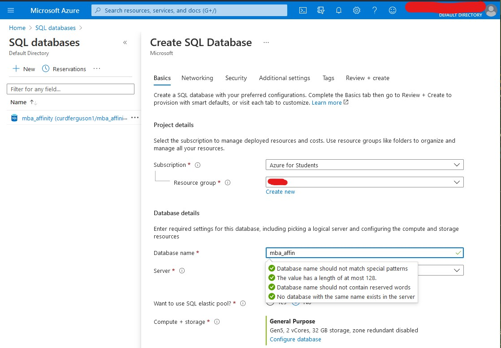

A basic 5 DTU (Data Transaction Unit - Microsoft's all-in-one measure for database storage capacity, performance speed, and read/ write bandwidth) database up to 50GB is included in the free "Azure for Students" pricing tier, and costs $4.99/ mo. otherwise.  

(And for all of your burning questions about how DTUs are computed, check out <https://sqlperformance.com/2017/03/azure/what-the-heck-is-a-dtu>.)


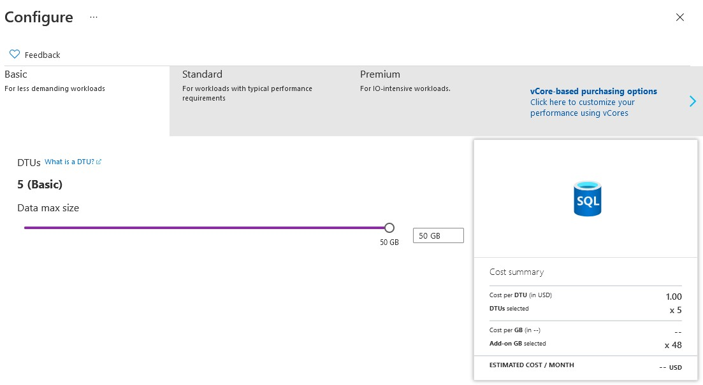
#### Azure Blob Storage Container

While we're at it, let's provision an Azure Storage Account that will give us a convenient place to host the .csv files we'll use to populate the eventual tables in our `mba_affinity` database.

The process is very similar to setting up our database above, and analogous.  We're first going to set up our storage account `curdferguson`...

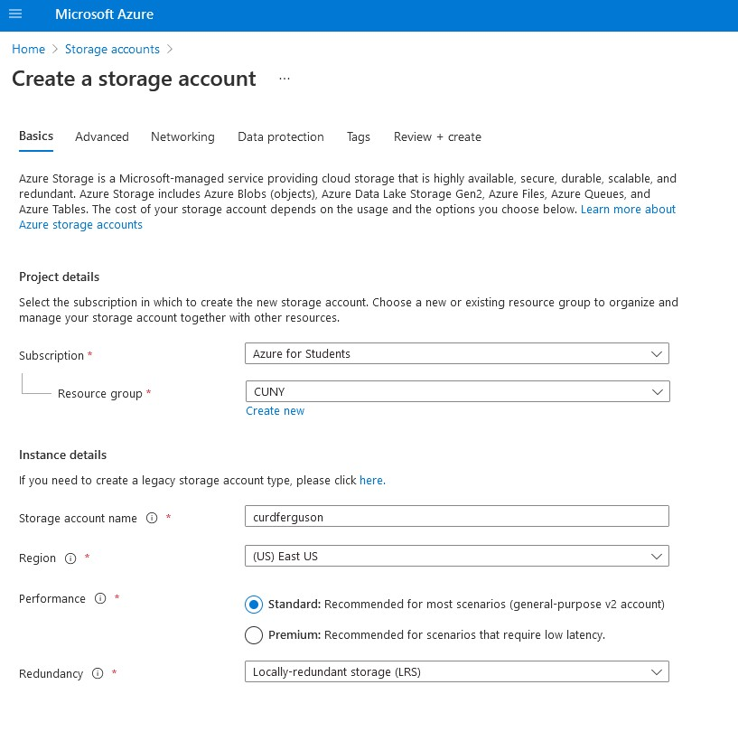
...and then create a 'container', which will store the .csv files we'll reference in our `BULK INSERT` SQL commands momentarily, to populate the database.

Take note of the Public Access Level **Container** specified here - this must be selected to allow direct access to the files stored therein.

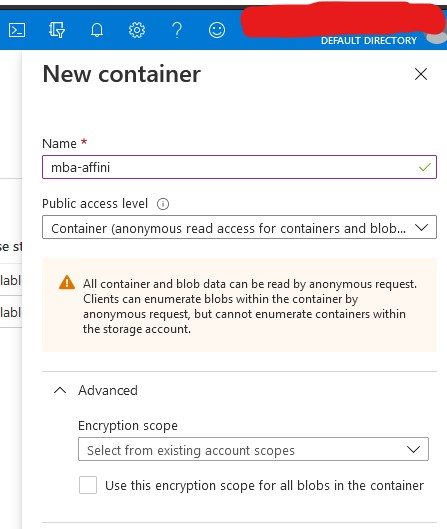


### Step 2: Connect to Microsoft SQL Server Management Studio 2019

To connect, we enter our database url, local port, and the server admin credentials we've defined for server `curdferguson1` in MS Azure, in the SQL Server Management Studio login.

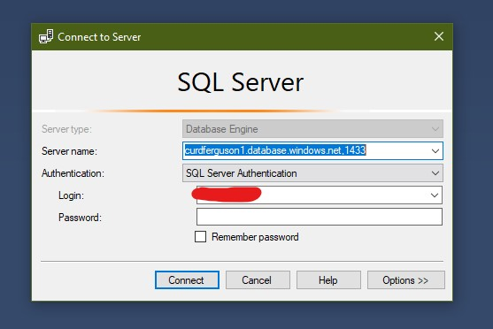


Once successfully connected, we can see the database `mba_affinity` in our Object Explorer.


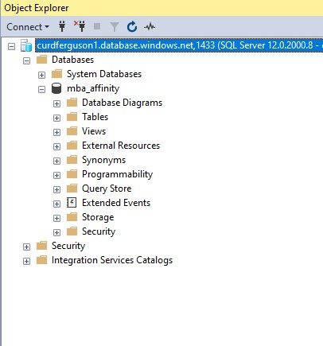

### Connect Blob Storage to SQL Database

We neeed to set up Azure Blob Storage Container `mba_affinity` as an external data source so that we can access it within our SQL Server queries.  We start by opening up a new query window within SQL Server Management Studio, and follow the following steps:


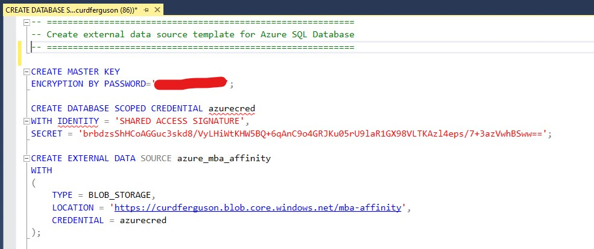


1.  We create a master key with unique password through the `CREATE MASTER KEY` command

2.  We use the `CREATE DATABSE SCOPED CREDENTIAL` command to store a unique, time limited, **Shared Access Signature** that authenticates our access to the container.  Our **Shared Access Signature** is created from the settings page of our `mba_affinity` Azure blob storage container...


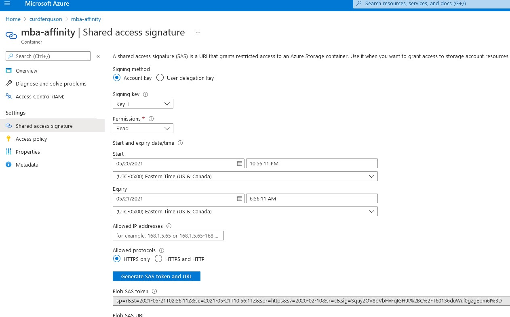


3.  Finally, we use the `CREATE EXTERNAL DATA SOURCE` command to instantiate the connection!  Once set up, we can see `azure_mba_affinity` as an external data source in our Object Explorer...


### Step 4: Import the Online_Retail_II dataset to R, and wrangle into four BULK INSERT - ready .csv files


#### Load the tidyverse library

```{r, messages=false}

library(tidyverse)

```


#### Import Online_Retail_II

```{r}

url <- "https://raw.githubusercontent.com/curdferguson/CUNY607final_MarketBasket/main/online_retail_II.csv"

online_retail <- read.delim(url, sep = ",", encoding = "UTF-8")

online_retail <- rename(online_retail,  InvoiceID = X.U.FEFF.Invoice, CustomerID = Customer.ID)

head(online_retail)

```


#### Creat out BULK INSERT .csv files


Our relational database will have 4 tables:  

- customers
- items
- invoices
- invoice_lines

The transformations here will ensure we format all records correctly in order to smoothly populate our tables in the database `mba_affinity`.


```{r}
# customer table
customers <- online_retail %>% filter(!is.na(CustomerID) & CustomerID != 12370) %>% distinct(CustomerID, Country) %>% arrange(by = CustomerID)
customers <- customers %>% filter(!duplicated(CustomerID))

#write_delim(customers, file = "customers.csv", delim = ",", na = "NULL", append = FALSE, col_names = TRUE)

# items table
items <- online_retail %>% filter(!is.na(StockCode) & CustomerID != 12370) %>% distinct(StockCode, Description, Price) %>% arrange(by = StockCode)
items$Description <- items$Description %>% str_replace_all(",", " ")
items <- items %>% filter(!duplicated(StockCode))
items$Price <- round(items$Price, 2)

#write_delim(items, file = "items.csv", delim = ",", na = "NULL", append = FALSE, col_names = TRUE)

# invoices table
invoices <- online_retail %>% filter(!is.na(InvoiceID) & CustomerID != 12370) %>% distinct(InvoiceID, InvoiceDate, CustomerID) %>% arrange(by = InvoiceID)
invoices$InvoiceID <- invoices$InvoiceID %>% str_trim(side = c("both"))
invoices <- invoices %>% filter(!duplicated(InvoiceID))

#write_delim(invoices, file = "invoices.csv", delim = ",", na = "NULL", append = FALSE, col_names = TRUE)

#invoice_lines table
invoice_lines <- online_retail %>% filter(!is.na(InvoiceID) & CustomerID != 12370) %>% mutate(LineID = "") %>% distinct(LineID, InvoiceID, StockCode, Quantity) %>% arrange(by = InvoiceID)
invoice_lines <- invoice_lines %>% select(LineID, InvoiceID, StockCode, Quantity)
  
#write_delim(invoice_lines, file = "invoice_lines.csv", delim = ",", na = "NULL", append = FALSE, col_names = TRUE)

```


#### Upload to Azure container...

On our way back to SMSS, we'll briefly pop back to our Azure storage container `mba_affinity` and upload our four .csv data files...

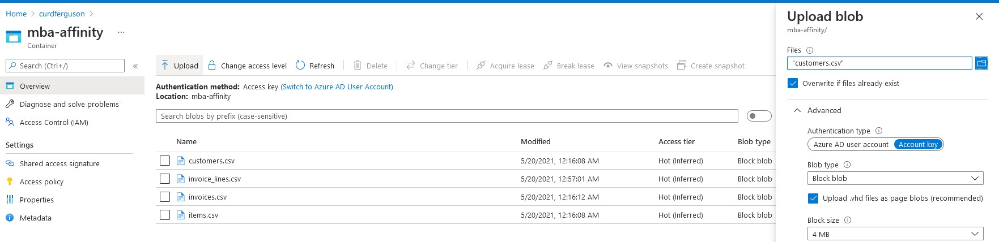

### Step 5: Populate the mba_affinity Database

#### CREATE TABLES & BULK INSERT

We're now ready to create our four tables, and populate them using bulk insert, an operation that takes approximately 1 minute.  

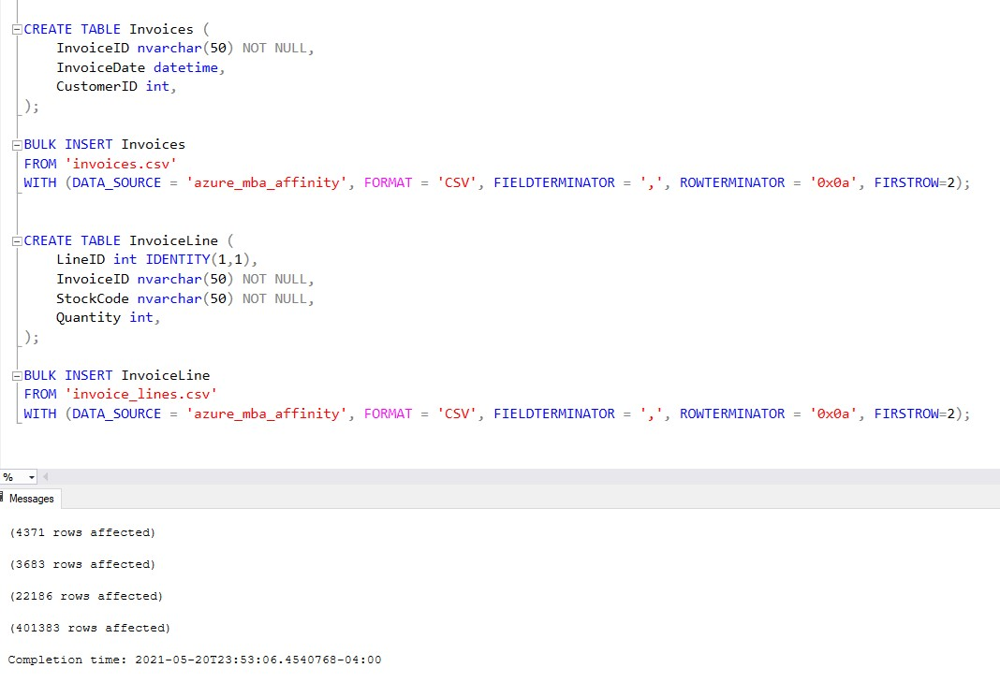


#### ALTER TABLES to establish keys defining parent-child relationships

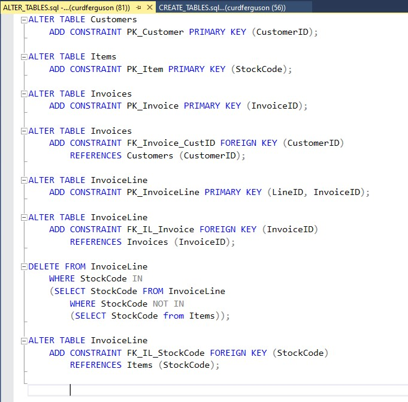

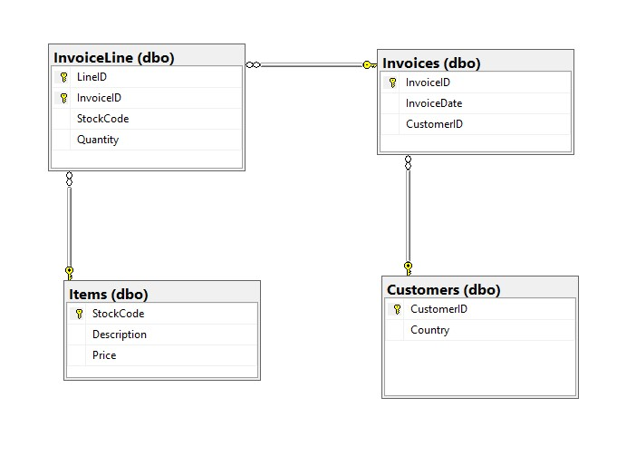

We end up with a basic normalized schema that joins our four tables to organize and store our transactional data.  To access it in the most efficient and streamlined way, we'll use views.  `TransactionLineView` recreates the initial Online Retail II dataset, while `TransactionTotalView` displays one line for each invoice and its total, aggregated from the individual Invoice Lines.

[]!(SSMS_create_views.jpg)


### Step 6: Create a Keyring to secure database access in R

Note: Code in this section and Step 7 is adapted from 607 Group Project 3 and credited to:  Esteban Aramayo.

```{r keyring-set-up, echo= FALSE}

library(keyring)

# ***************************************************************************************************************
# Before connecting to the database, let's do a ONE-TIME set up of a Key Ring to secure the database credentials
# Uncomment the lines of code below to set up your key ring. Then within it set the database credentials
# Once the setup is completed comment the code out again
# ***************************************************************************************************************

# # if  you haven't done already, install the "keyring" package on your system
# # install.packages("keyring")
# library(keyring)
# 
# # Create a new key ring that is password protected (you will be prompted to set the password)
#keyring::keyring_create("TF_607final_keyring")
# 
# # unlock your keyring to start using it
#keyring::keyring_unlock("TF_607final_keyring")
# 
# # set the database username key (you will be prompted to enter the values)
#keyring::key_set(service = "TF_607final_keyring_user", keyring = "TF_607final_keyring")
# 
# # set the database password key (you will be prompted to enter the values)
#keyring::key_set(service = "TF_607final_keyring_pwd", keyring = "TF_607final_keyring")
# 
# #lock your keyring to stop using it
#keyring::keyring_lock("TF_607final_keyring")

# For more info on how to use keyring watch this video:  https://www.youtube.com/watch?v=Q8Cilx-MOsU

```


### Step 7: Connect to database and import from `TransactionLineView`

We use the package RODBC to connect to our Azure SQL database and import data off of `TransactionLineView`.

```{r}

#library(RODBC)

#
#keyring::keyring_unlock("TF_607final_keyring")
#
#connection_string <- paste('Driver={ODBC Driver 13 for SQL Server};
#                           Server=curdferguson1.database.windows.net,1433; 
#                           Database=mba_affinity; 
#                           Uid=', key_get(service = "TF_607final_keyring_user", keyring = "TF_607final_keyring"), '; 
#                           Pwd=', key_get(service = "TF_607final_keyring_pwd", keyring = "TF_607final_keyring"), '; 
#                           Encrypt=yes; 
#                           TrustServerCertificate=no; 
#                           Connection Timeout=30;', sep="")

#dbConnection <- odbcDriverConnect(connection_string)

#load raw data from SQL database
#transactions_raw <- sqlQuery(dbConnection, "SELECT * FROM TransactionLineView;")
#head(transactions_raw)

#write to .csv file
#write_delim(transactions_raw, "transactions_raw.csv", delim = ",", na = "", append = FALSE, col_names = TRUE)

# Close the database connection and lock keyring
#close(dbConnection)
#keyring::keyring_lock("TF_607final_keyring")


```


### References:

Calbimonte, Daniel.  "How to use BULK INSERT to import data locally and in Azure." SQLShack.  https://www.sqlshack.com/use-bulk-insert-import-data-locally-azure/

UCI Machine Learning Repository.  "Online Retail II."  https://archive.ics.uci.edu/ml/datasets/Online+Retail+II#
